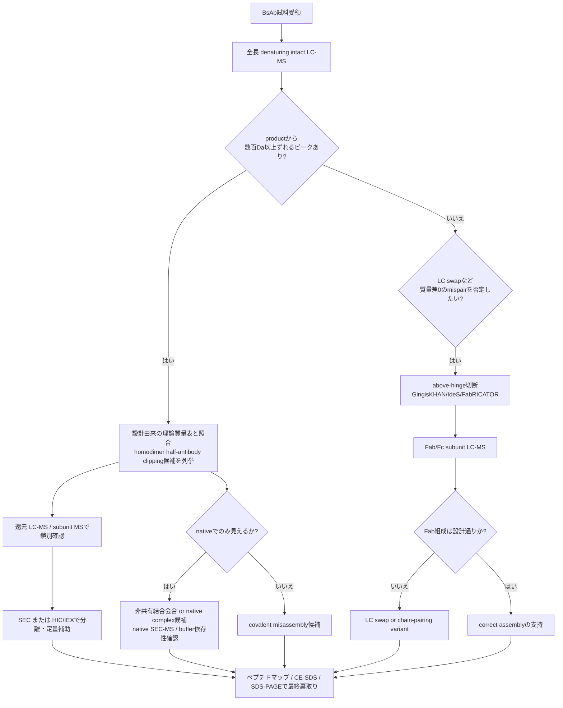

# 抗体の intact MS デコンボリューション後ピーク帰属の実務ノウハウ

## エグゼクティブサマリ

抗体 intact MS のピーク帰属は、単に観測質量を理論質量へ当てる作業ではなく、まず「糖鎖ラダーか」「小さな化学修飾か」「配列差・切断か」「アダクトやデコンボリューション由来の見かけピークか」を切り分ける作業である。実務上の一次判定は、Fc N 型糖鎖で頻出する +162.053（Hex/Gal/Man）, +146.058（Fuc）, +203.079（HexNAc）, +291.095（Neu5Ac）の組合せを最優先し、その後に −17.027（N 末端 Gln→pyroGlu）, +15.995（酸化）, +0.984（脱アミド化）, +79.966（リン酸化）などを当てるのが最も再現性が高い。さらに、full-length IgG の intact スペクトルは通常 isotopically unresolved であり、ReSpect や MaxEnt1 は平均質量ベースの表示になりやすい一方、より小さいサブユニットでは Xtract などで monoisotopic mass を扱えるため、理論質量の計算基準をソフトウェアの表示基準に合わせないと帰属を誤る。 citeturn22view0turn13view2turn13view3turn14view0

ヒト化/ヒト抗体の IgG1、IgG2、IgG4 では Fc N 型糖鎖が first-pass の主候補であり、IgG3 ではヒンジ O 型糖鎖を実際の候補に入れるべきである。加えて、完全長 intact レベルでは G1F/G1F と G0F/G2F のような等質量組合せ、さらに Fab 糖鎖がある抗体では Fc と Fab の糖鎖組合せが追加で重なり、質量一致だけで構造一意化できない。したがって、帰属の確度は intact 単独ではなく、還元/非還元 MS、PNGase F・Sialidase・EndoS などの酵素処理、above-hinge/IdeS/GingisKHAN 型のサブユニット化、ペプチドマップ、IEX、SEC、SDS-PAGE/CE-SDS を順に重ねて上げるべきである。 citeturn10search0turn21search2turn22view0turn10search10turn23search15turn29search1turn29search5turn38view0turn31search4

BsAb では intact LC-MS が特に有効で、ミスペア種の多くは正しい産物から数百〜数千 Da ずれるため、初期工程開発では迅速なスクリーニング法になる。一方で light-chain swap のように質量差 0 Da のミスペアは intact 全長質量だけでは見えず、above-hinge 切断後のサブユニット LC-MS が必要である。半抗体は多くの IgG-like BsAb で全長のおおむね半分付近に現れ、ホモアソシエーション/ホモダイマーは native では残って denaturing で崩れる一方、アダクトや過剰平滑化でも偽ピークが生じるため、native/denaturing 比較、還元、SEC/IEX、原スペクトルでの charge-state 一貫性確認が必須である。 citeturn37view0turn36view0turn18view2turn19search7turn25search1turn28search18

## 対象範囲と帰属の基本原則

本レポートの対象は、ヒト化/ヒト抗体、IgG サブクラス、IgG-like BsAb を含む intact MS である。IgG 抗体では Fc 領域 Asn297 の N 結合型糖鎖が主要な質量不均一性の源であり、IgG1/2/4 ではまず Fc N 型糖鎖を帰属候補の最上位に置くのが合理的である。IgG3 についてはヒンジ領域 O 型糖鎖が既知であり、通常の IgG1/2/4 より O 型糖鎖候補の優先度を上げるべきである。また、Fab 糖鎖や非ヒト型糖鎖を持つ抗体、あるいは engineered glycoform を持つ分子では、Fc だけを仮定した帰属は破綻しやすい。 citeturn29search18turn34search20turn10search0turn34search16

full-length 抗体の denaturing intact MS では charge envelope が広く、full-length mAb は通常 isotopically unresolved であるため、Thermo の ReSpect や Waters の MaxEnt1 のような平均質量ベースのデコンボリューションが中心になる。逆に、還元 LC やサブユニット化後の 20–50 kDa 級では isotopic resolution が得られることがあり、Xtract などで monoisotopic mass を使える。したがって、候補質量差を一覧化するときの exact Δm をそのまま full-length 平均質量へ機械的に当てるのではなく、「候補抽出は exact Δm」「最終照合は使用ソフトと同じ mass basis」で行うのが安全である。 citeturn22view0turn13view2turn13view3turn14view2

原スペクトルの品質指標も帰属の成否を左右する。Waters の routine intact mAb 条件では、背景化学ノイズは 1 秒スキャンで 1000 ion counts 未満が目安とされ、隣接 glycoform の valley は base peak のおよそ 30% 程度以下が望ましいとされる。背景が高い、あるいは valley が浅い状態では、minor PTM や low-level mispair の帰属はソフト上で見えても実体が薄くなる。 citeturn12view1turn13view4

| 単位差分として先に覚えるべき候補 | Δ質量の目安 | 実務メモ |
|---|---:|---|
| Hex または Gal または Man | +162.053 Da | G0F→G1F、M5→M6、terminal Gal 追加で頻出。 citeturn22view0 |
| HexNAc | +203.079 Da | bisecting GlcNAc、分岐増加、GlycINATOR/Endo 系の解釈に有用。 citeturn22view0turn29search12 |
| Fucose | +146.058 Da | afucosylated/cored-fucosylated の切替。 citeturn22view0 |
| Neu5Ac | +291.095 Da | sialylation 候補。Sialidase で検証しやすい。 citeturn22view0turn30search1 |
| N 末端 Gln→pyroGlu | −17.027 Da | 片鎖なら −17、両鎖なら −34 近傍。IEX では charge variant 化しやすい。 citeturn8search3turn11search2turn38view0 |
| 酸化 | +15.995 Da/部位 | +16、+32、+48、+64 ラダーとして見えることがある。 citeturn8search0turn41view0 |
| 脱アミド化 | +0.984 Da/部位 | intact 全長では単独分離しにくい。IEX と peptide map を併用。 citeturn8search2turn38view0 |
| リン酸化 | +79.966 Da/部位 | 稀だが候補からは外さない。MS2 と peptide map が必要。 citeturn8search1turn9search19 |
| 脱メチル化 | −14.016 Da/部位 | 構築体依存。配列/設計情報照合が必須。 citeturn9search9turn12view0 |
| Na/K アダクト | 約 +22 / +38 Da | 1 本の真性ピークではなくラダー・ピーク幅増大として出やすい。 citeturn20search6turn20search3 |
| TFA+Na 背景 | +136 Da 間隔 | 典型的な汚染シグネチャ。 citeturn20search1 |
| native バッファ由来アダクト | +44 Da 間隔 | native mAb での buffer adduction の典型例。 citeturn40view0 |

## 帰属候補の詳細表

| 帰属候補 | 期待される質量差 | intactMS での見え方と強度傾向 | 主な発生原因 | 検証方法 | 確度を上げる実務チェック |
|---|---|---|---|---|---|
| N 型糖鎖の主要型 G0F/G1F/G2F | 糖鎖 1 本あたりおおむね G0F 1444.534、G1F 1606.587、G2F 1768.639。隣接ピーク差は主に +162.053 Da。G1F/G1F と G0F/G2F は等質量。 citeturn22view0turn40view0 | ヒト化/ヒト IgG1/2/4 では first-pass の主ピーク帯。Waters mAb 標準では G0F/G1F 31.0%、G0F/G0F 25.7%、G1F/G1F 23.9%、G1F/G2F 13.0%、G2F/G2F 6.45% が例示されているが、製品差は大きい。 citeturn12view1turn23search5 | 細胞株・培地・培養期間・下流精製・細胞内糖鎖加工差。Fc 糖鎖は CQA であり製造条件依存性が高い。 citeturn34search9turn34search20 | 還元 MS で HC へ落として glycoform 単純化、PNGase F で全脱糖鎖、EndoS/GlycINATOR で Fc 糖鎖簡素化、released glycan/HILIC-FLD-MS、ペプチドマップ。 citeturn29search1turn29search5turn29search12turn10search10 | まず +162 ラダーで説明できるかを見る。full-length のみで G1F/G1F と G0F/G2F を一意化しない。Fab 糖鎖がありうる抗体では Fc-only モデルで決め打ちしない。 citeturn22view0turn23search15turn10search10 |
| 高マンノース M5–M9 | M5→M6→M7… は各 +162.053 Da。M5 1 本は約 1216.423 Da。 citeturn22view0 | 多くの CHO mAb では minor だが、高マンノースは 1%〜20%超の範囲がありうる。製品によっては未検出〜低数%で、main complex-type の肩/尾に出やすい。 citeturn23search9turn23search5 | 細胞内糖鎖成熟の不完全さ、培養条件、細胞株差。 citeturn23search9turn34search20 | released glycan、HC/subunit MS、PNGase F、EndoS 系の反応性確認。IgGZERO/EndoS は high-mannose/hybrid に限定的なことがある。 citeturn29search14turn29search5 | complex-type と高マンノースの混同を避けるため、released glycan か glycopeptide を少なくとも 1 回当てる。EndoS で消えないからといって「非糖鎖」とは断定しない。 citeturn29search14 |
| 分岐・bisecting・afucosylation・非ヒト型を含む glycosylation abnormality | afucose は −146.058、bisecting GlcNAc は +203.079、extra Gal は +162.053、extra sialic acid は +291.095。非ヒト型 α-Gal や NGNA は組成依存で、intact 単独では構造一意化しにくい。 citeturn22view0turn33search0turn34search3 | afucosylated/bisected は main peak の隣に中〜低強度で出ることがある。α-Gal/NGNA は通常 modern CHO では低レベルだが、非ヒト細胞や特定工程では CQA になる。 citeturn34search3turn33search7turn34search17 | 発現宿主、glycoengineering、培地・プロセス差、Fab 余剰 sequon、非ヒト細胞由来。 citeturn34search20turn34search16 | released glycan、glycopeptide、Sialidase、fucosidase/branch-specific exoglycosidase、Fab/Fc 分離 LC-MS。 citeturn30search1turn10search10turn34search9 | intact だけで「異常糖鎖」と決めず、最初に Fc 既知 glycan 組合せと Fab glycan の可能性を列挙する。非ヒト型を疑うときは宿主情報を必ず確認する。 citeturn34search16turn33search7 |
| O 型糖鎖 | 代表候補として Tn +203.079、core 1 +365.132、mono-sialyl core 1 +656.228、di-sialyl core 1 +947.323。いずれも残基質量からの計算値。 citeturn22view0turn10search0turn10search7 | IgG1/2/4 では通常 first-pass 候補ではなく、IgG3 ヒンジや稀な Fab O-glycan を持つ分子で候補化する。多くは partial occupancy のため低強度〜中強度。 citeturn10search0turn10search7 | IgG3 のヒンジ O-glycosylation、分子固有の Fab O-glycan、engineered construct。 citeturn10search0turn10search7 | Sialidase 前後比較、O-glycan 特異的酵素、middle-up/subunit MS、ペプチドマップ。SialEXO は N/O 両方の末端シアル酸除去に使える。 citeturn30search1turn30search6 | IgG3 以外で O-glycan を呼ぶ前に、まず Fab N-glycan、タグ残存、塩アダクトを除外する。シアル酸を外して差分が説明できるかを見る。 citeturn10search0turn30search1 |
| 脱グリコシル化 | 失われた glycan 分だけ減少。例: G0F 1 本喪失で約 −1444.534、G1F で約 −1606.587、G2F で約 −1768.639。PNGase F 完全脱糖鎖では各部位で glycan を失い、部位の Asn は Asp 化する。 citeturn22view0turn29search1turn8search2 | 部分脱糖鎖なら主ピークから大きく左シフトした discrete peak、完全脱糖鎖なら全体が大きく軽くなる。強度はサンプル処理由来なら minor、設計・酵素処理なら dominant。 citeturn29search1turn29search2 | PNGase F 処理、保存中の糖鎖不安定化、工程由来の glycan trimming、サンプル前処理。 citeturn29search1turn29search2 | PNGase F、EndoS、released glycan、HC MS。EndoS は Fc の chitobiose core で切り、GlycINATOR は core GlcNAc を残して complexity を落とせる。 citeturn29search5turn29search12 | 「脱グリコシル化」と「高マンノース/異常糖鎖」を mass だけで混同しない。酵素未処理試料と並べて差分で見る。EndoS の基質制限も確認する。 citeturn29search14 |
| N 末端 Gln→pyroGlu | 1 鎖あたり −17.027 Da。両鎖なら −34.053 Da。 citeturn8search3turn11search2 | intact では小さいが、片鎖/両鎖の組合せで肩ピーク化する。IEX では charge variant として目立つことがある。mAb では高変換率例もある。 citeturn11search2turn38view0turn35search5 | 発酵中、精製中、保管中。N 末端 Gln の cyclization は mAb で高率に進むことがある。 citeturn11search2turn35search17 | ペプチドマップ N 末端確認、還元 LC-MS で鎖別確認、IEX。 citeturn11search2turn38view0 | product と N-terminal Q form が共存しうる。BsAb の場合は各鎖ごとに片鎖 17 Da ずつの組合せを先に全列挙する。 citeturn37view0 |
| アミノ酸欠失・末端トリミング | Δm は失われた残基の和。例として Lys は −128.095/残基。C 末端 Lys clipping は mAb でよく見る。 citeturn32search0turn38view0 | 末端切断なら discrete peak として現れやすい。強度は工程/分解依存。C 末端 Lys は IEX で目立ち intact では同位体 unresolved の shoulder として見えることがある。 citeturn38view0 | 発現後プロセシング、carboxypeptidase、精製/保存中の clipping、設計差。 citeturn38view0 | 配列/FASTA に基づく theoretical mass 再計算、還元 LC-MS、ペプチドマップ、IEX。Thermo の targeted workflow は N/C truncation を modification list に含められる。 citeturn12view0turn38view0 | deletion を呼ぶ前に pyroGlu や glycan 組合せで説明できないかを先に確認する。BsAb では設計上の chain-to-chain 質量差も必ず反映する。 citeturn12view0turn37view0 |
| ペプチドボンド切断・クリッピング | 切断そのものは「残った断片の質量」で現れる。還元前にジスルフィドでつながった clipped species は full-length 近傍にも残りうる。 citeturn31search4turn36view0 | nonreducing intact では主分子に近い異常ピーク、reducing では明瞭な fragment として現れる。BsAb では HHL や half-antibody fragment が典型。 citeturn37view0turn36view0 | 精製/保存中の fragmentaion、酸化/脱アミド化に伴う脆弱化、製法ストレス。 citeturn31search17turn31search4 | 還元/非還元 MS、還元/非還元 SDS-PAGE または CE-SDS、ペプチドマップ、SEC。 citeturn31search4turn31search17turn18view2 | nonreducing SDS-PAGE 自体でも fragmentation artifact を生みうるので、SDS 系の所見を single truth にしない。LC-MS で還元前後両方を取る。 citeturn31search7 |
| 酸化 | +15.995 Da/酸化。複数なら +32, +48, +64… 。 citeturn8search0turn41view0 | baseline では微量〜低率でも、強制酸化では +16 ラダーが明瞭。Thermo の IgG1 例では stressed intact で +64 Da が観測され、4 Met oxidation が示唆された。 citeturn41view0 | 生産中の酸化ストレス、過酸化物、光、金属、保存中ストレス。Met/Cys/His/Trp が感受性。 citeturn11search13turn41view0 | intact、IdeS 後 Fc/2 や Fd’ の subunit MS、ペプチドマップ。IEX でも basic variant の候補になる。 citeturn41view0turn38view0 | +16 が glycan 由来の別組合せで説明できないか確認し、重なる場合は subunit と site-specific peptide map へ進む。元スペクトルの全 charge state で同じ shift があるかを見る。 citeturn41view0 |
| 脱アミド化 | +0.984 Da/部位。succnimide 中間体や isoAsp を含めると intact だけでは複雑。 citeturn8search2turn35search13 | full-length intact では 1 Da 未満差のため単独ピーク化しにくく、IEX では acidic species として先に見えることが多い。強度は通常 minor だがストレスで増える。 citeturn38view0turn35search13 | 製造・保存中の Asn/Gln 周辺配列依存反応、pH・温度・時間。 citeturn11search13 | ペプチドマップが第一選択。IEX で fractionate してから intact/subunit、必要なら 2D-LC/MS。 citeturn38view0turn35search1 | full-length intact だけで deamidation を確定しない。まず IEX で acidic peak を取り、そこから intact/subunit/peptide の順で詰める。 citeturn38view0 |
| 脱メチル化 | −14.016 Da/部位。比較対象が methylated ならその差として現れる。 citeturn9search9 | 抗体 QC では first-line 候補ではなく、通常は微量または construct-specific。単独で呼ぶより「配列/設計差がある場合の候補」として扱う方が安全。 citeturn12view0turn9search9 | engineered construct、host PTM、化学処理、既知 reference との差。構造依存。 citeturn12view0turn9search9 | sequence matching、ペプチドマップ、既知参照品比較。 citeturn12view0 | 14 Da 差は adduct/同位体処理誤りでも見かけ上出うる。原スペクトルの charge-state 一貫性と peptide-level 根拠がそろうまで provisional 扱いにする。 citeturn25search1turn39search10 |
| リン酸化 | +79.966 Da/部位。 citeturn8search1 | 抗体 intact では first-pass では頻度が高くないが、+80 近傍差は候補から外さない。低占有率のことが多い。 citeturn8search1turn9search19 | 生産細胞由来の PTM、engineering。 citeturn8search1 | ターゲット peptide map、MS/MS、必要なら enrichment。phosphopeptide は一般に ionization と安定性の点で難しい。 citeturn9search19 | +80 を glycan 断片や deconvolution artifact と混同しない。intact では候補提示に留め、部位同定は必ず peptide で行う。 citeturn25search1turn9search19 |
| アダプター/タグ残存・leader processing 不完全 | Δm は残存配列そのものの理論質量。数十〜数千 Da まで設計依存。 citeturn12view0turn32search0 | 主成分近傍の discrete peak として出る。糖鎖ラダーに乗らない、酵素処理で動かない、鎖別では一方の chain のみがずれる、という見え方が多い。 citeturn12view0 | シグナルペプチド切断不完全、タグ残存、アダプター残り、fusion junction 未切断。 citeturn12view0 | construct FASTA、vector map、N 末端シーケンス、還元 LC-MS、ペプチドマップ。 citeturn12view0 | 生物学的 PTM を疑う前に、実際の発現コンストラクトを確認する。CMC 文書と解析者の theoretical mass が一致しているかを最初に監査する。 citeturn12view0 |
| 金属結合・塩アダクト | adventitious Na 約 +22、K 約 +38、TFA+Na は +136 間隔。native では +44 Da adduct ladder も典型。 citeturn20search6turn20search1turn40view0 | 真の proteoform というよりラダー・ピーク幅増大・S/N 低下で見える。塩 adduction は signal を分散させ minor species を埋もれさせる。 citeturn20search3turn20search20 | 塩・ガラス・容器・移動相純度・TFA 汚染・native buffer 残留。 citeturn20search1turn20search11turn20search20 | 脱塩、buffer exchange、TFA 回避、blank/洗浄、native buffer の最適化、再測定。 citeturn20search1turn20search3turn40view0 | 一定間隔のラダーならまず adduct を疑う。全 charge state で同じ stoichiometric proteoform として再現し、脱塩後も残る場合だけ真性金属結合候補に上げる。 citeturn20search3turn19search7 |
| 非共有結合複合体 | partner mass の和で増加。native では抗原・自己会合体・高次会合体として出る。denaturing で崩れる。 citeturn19search7turn40view0turn40view1 | native では dimer/trimer/tetramer や mAb/Ag complex の discrete species として見える。denaturing RPLC-MS へ切替えると消失する。強度は buffer・濃度依存。 citeturn40view0turn19search7 | 高次会合、抗原結合、 formulation 由来非共有結合複合体。 citeturn40view0turn40view1 | native/denaturing 比較、SEC-MS、濃度依存性確認、軽い酸化/有機溶媒での可逆性確認。 citeturn18view2turn40view0 | native でしか見えないピークを covalent clipping と誤認しない。必ず denaturing intact と対で見る。 citeturn40view0turn19search7 |
| BsAb のミスペア、半抗体、ホモアソシエーション | many mispairs are hundreds to thousands Da away from product。DuetMab 例では dual lambda −469、dual kappa +469、LC swap 0、他の byproduct は −634〜+634 Da。半抗体例は約 74,989 Da、cysteinylated half-antibody はさらに +124 Da。 citeturn37view0turn36view0 | intact LC-MS ではミスペアの多くが product 近傍の別ピークとして見える。半抗体は概ね全長の半分付近。LC swap は全長 intact 質量では見えない。homodimer/homomer は native/SEC/HIC/IEX で補助が必要。 citeturn37view0turn18view2turn12view2 | chain pairing エラー、KIH 不完全、in vitro assembly 不完全、低 pH 精製・保存での hole-hole 変化、部分切断。 citeturn16view2turn37view0 | denaturing intact LC-MS、above-hinge digestion 後 subunit LC-MS、HIC、SEC、IEX、reducing/nonreducing SDS-PAGE/CE-SDS。LC swap には GingisKHAN/IdeS 型サブユニット化が必須。 citeturn37view0turn18view2turn31search17 | product mass からの差分表を先に全部作る。質量差 0 の mispair がありうる設計では、全長 intact で陰性でも「正しい assembly」とは言わない。さらに crude 中では ion suppression で hole-hole dimer が見えにくくなる。 citeturn37view0 |

## デコンボリューションのアーチファクトと対策

- 過剰なスムージング・広すぎる peak width  
  MaxEnt1 では peak width at half height と iteration 数がデコンボリューション品質に最も大きく効く。width を広げすぎると、真の shoulders や minor glycoforms がつぶれて単峰化しやすい。見分け方は、raw spectrum 側の隣接 glycoform valley が十分浅くないのに、deconvoluted spectrum だけが異常にきれいすぎる場合である。Waters では raw の valley が base peak の約 30% 程度以下であることを品質目安としている。対策は、まず raw window を analyte apex へ絞り、peak width を必要最小限に戻し、deconvolution 再計算でピークの有無が安定するかを見ることだ。 citeturn13view4turn14view0turn12view1

- 過剰適合・衛星ピーク・harmonic artifact  
  intact/native deconvolution では、raw data へ過度に合わせこむと noise や background、peak-shape の癖まで zero-charge spectrum に移写され、artifact が増える。UniDec 関連文献では overfitting を避けるための score 化や、parsimonious deconvolution により artifacts や harmonics を減らす考え方が示されている。見分け方は、(i) パラメータを少し変えるとピークが容易に消える、(ii) 対応する複数 charge state に一貫した根拠がない、(iii) subunit/酵素処理と論理的に接続しない、の三つである。 citeturn25search1turn25search3turn28search18turn28search12

- 1 Da 前後の見かけずれ  
  Xtract では overlap 処理や charge range 設定が不適切だと 1 Da 前後のずれが出ることがあり、Thermo のガイドでは「1 Da ずれるなら consider overlaps を off にする」ことが明示されている。full-length 抗体で monoisotopic と average mass の表記が混ざっても見かけ上のずれを生む。対策は、resolved/unresolved のどちらを前提にしているかを先に固定し、ソフトの algorithm と mass basis を揃えることである。 citeturn15view0turn22view0turn13view3

- マスドリフト・キャリブレーション不良  
  deconvoluted MW の精度は、instrument tuning、calibration、spectral purity に依存する。Waters の routine note では major glycoform で通常 <50 ppm、良好条件で 5–20 ppm が目標とされる。見分け方は、「全ピークが同一方向へ同程度ずれる」「別サンプルでも同方向にずれる」「reference mAb でも同じずれを出す」ことである。対策は、reference mAb あるいは lock mass 相当のバッチ内 QC を必ず入れ、mass shift correction を生データ段階で実施することだ。 citeturn13view4turn39search10

- アダクト  
  TFA+Na の +136 Da ラダー、Na/K の +22/+38、native の +44 Da adduct は典型的で、真の proteoform と誤認しやすい。塩 adduction は protein signal を複数 adducted ion へ分散させ、各ピークの S/N を下げ、スペクトルを広げる。対策は、脱塩、TFA から FA/DFA への切替、LC 洗浄、容器・水質の見直し、native では ammonium acetate への buffer exchange である。 citeturn20search1turn20search3turn20search11turn20search20turn40view0

- イオン抑制  
  crude matrix や高塩条件では low-level species が見えなくなる。BsAb のケーススタディでも crude sample では hole-hole dimer の intensity が他 species による signal suppression で低く見えた。対策は、on-line desalting、2D-LC heart-cutting による minor peak enrichment、RT 窓の最適化、blank と standard の連続測定である。 citeturn37view0turn38view0turn12view1

- パラメータ最適化の実務ガイドライン  
  denaturing full-length IgG の一例として、Orbitrap Exploris 240 では m/z 2000–5000、30,000 resolution、AGC 3E6、max IT 200 ms、ReSpect、model mass range 10,000–160,000 Da、charge state 10–100、target mass 160,000 Da、matching 10 ppm が使われている。Waters MaxEnt1 の例では output mass 147,000–150,000、resolution 0.20 Da/channel、width at half height 2.75 Da、minimum intensity ratio 左右 33%、maximum iterations 15 が推奨されている。native では m/z 350–20,000、resolution 17,500–140,000、microscans 10、in-source CID 60–150 eV を desolvation に合わせて調整する。Xtract の例では S/N 3、charge range 5–50 が示されている。これらは出発点であり、実際には分子量、native/denaturing、BsAb/complex の別で調整する。 citeturn13view3turn14view0turn40view0turn15view0turn14view2

## BsAb特有の解析手順

BsAb では「質量差があるミスペア」と「質量差がないミスペア」を最初から分けて考える必要がある。質量差がある群には dual-kappa/dual-lambda、hole-hole/knob-knob 由来 species、半抗体、片腕欠損、クリップ体などが含まれ、intact LC-MS で早期スクリーニングできる。実際、DuetMab の例では dual lambda が −469 Da、dual kappa が +469 Da、その他の byproduct が −634〜+634 Da に分布し、intact LC-MS により工程サンプル中の mispair を識別できた。 citeturn37view0

一方、light-chain swap は全長質量差が 0 Da になりうるため、全長 intact mass が正しいからといって correct assembly とは言えない。Wang らはこの点に対し、above-hinge の GingisKHAN 切断で 2 つの Fab と 1 つの Fc に分け、Fab の質量差で LC swap を識別している。したがって、BsAb の「陰性証明」は full-length intact ではなく、subunit LC-MS まで含めて初めて成立する。 citeturn37view0

半抗体は、IgG-like BsAb では理論上 HC+LC 一組なので full-length のほぼ半分に出ると推定でき、ケーススタディでも 74,989 Da の hole half-antibody、さらに cysteinylation を伴う +124 Da 種が観測されている。hole-hole homodimer などのホモアソシエーションは、native/SEC/HIC/IEX を組み合わせると product との分離や conformer 評価がしやすい。工程開発では intact LC-MS が速く、ロットリリース寄りの定量では HIC や IEX の方が QC 適性が高い。 citeturn36view0turn16view2turn18view2

BsAb の質量シグネチャを実務で扱うときの要点は次の三つに集約できる。第一に、product との差分表を「設計の前」に必ず作ること。第二に、mass-neutral mispair を想定する設計では subunit 化をルーチンに入れること。第三に、粗試料では ion suppression により low-level homodimer や half-antibody が見落とされるので、必要なら 2D-LC heart-cut や affinity 分画で濃縮してから判断することである。 citeturn37view0turn38view0

## 実務チェックリスト

1. 解析前に theoretical mass library を作る。  
   full-length product、主要 Fc glycoform 組合せ、想定される pyroGlu、酸化、deamidation、C 末端 clipping、BsAb mispair、タグ残存まで含めた候補表を先に作る。Thermo の targeted workflow は sequence manager で glycosylation、disulfide、N/C 末端 truncation などを事前定義できる。 citeturn12view0turn37view0

2. 原スペクトル QC を先に通す。  
   背景化学ノイズ、charge envelope の再現性、隣接 glycoform valley、blank の汚染を確認する。背景が高い、+136 や +44 ラダーがある、複数 charge state で相対強度が一致しない場合は、帰属より先に前処理・LC 洗浄・脱塩を行う。 citeturn12view1turn20search1turn40view0

3. algorithm を分子サイズに合わせる。  
   isotopically unresolved な full-length mAb/BsAb は ReSpect/MaxEnt1、より小さい鎖や subunit は Xtract を使う。resolved/unresolved の切替を誤ると 1 Da 前後のずれや見かけピークが出る。 citeturn13view2turn13view3turn15view0turn22view0

4. first-pass 帰属は glycan-first で行う。  
   full-length IgG の未説明ピークは、まず +162/+146/+203/+291 の組合せで説明できるかを確認する。等質量組合せがあるため、説明できても「確定」とは書かず、「候補」とする。 citeturn22view0turn21search2

5. +16、−17、+0.984、+80 を second-pass 候補にする。  
   glycan で説明できない差分に対して、酸化、pyroGlu、deamidation、phosphorylation を当てる。deamidation は full-length intact では見えにくいので、IEX の acidic peak を見てから peptide map へ進む。 citeturn41view0turn11search2turn38view0turn9search19

6. 酵素処理で構造空間を削る。  
   PNGase F で N 糖鎖を全落とし、Sialidase でシアル酸を外し、EndoS/GlycINATOR で Fc glycan complexity を簡素化する。酵素前後で差が論理的につながらない候補は下げる。 citeturn29search1turn30search1turn29search5turn29search12

7. 還元/非還元の対比較を必ず取る。  
   full-length で見えた異常ピークが、還元後に HC/LC 片側へ落ちるのか、fragment 化して初めて見えるのかで、糖鎖/PTM と clipping/misassembly を切り分ける。必要に応じて nr/rCE-SDS や SDS-PAGE を追加する。 citeturn31search4turn31search17turn18view2

8. BsAb では mass-neutral mispair を否定する追加系を入れる。  
   light-chain swap の質量差は 0 Da になりうるので、above-hinge digestion による subunit LC-MS を標準にする。ロット評価には HIC や IEX の方が定量・再現性に向く。 citeturn37view0turn18view0

9. native と denaturing を使い分ける。  
   noncovalent complex や高次会合、homo/hetero-association は native で見る。逆に covalent mass の確定は denaturing が基本である。native でしか見えないピークは、まず complex か buffer adduction を疑う。 citeturn19search7turn40view0turn40view1

10. 最終報告は「一致」ではなく「確度」で書く。  
   A: intact と subunit/酵素/peptide が整合、B: intact と 1 つの直交法が整合、C: intact 質量一致のみ、D: artifact 未除外、のように confidence tier を付ける。これは regulatory/comparability の議論でも有効である。 citeturn12view0turn39search4turn27search10

## 推奨ツールとデコンボリューションパラメータのテンプレート

### 推奨ツール

| 区分 | ツール | 向いている用途 | 実務上の強み |
|---|---|---|---|
| 商用 | Thermo BioPharma Finder / Chromeleon Intact Protein Deconvolution | denaturing/native intact、targeted/untargeted、sequence matching、regulated report | ReSpect/Xtract/Sliding Window を同居させ、protein workbook ベースでターゲット照合と報告を標準化しやすい。 citeturn12view0turn27search0 |
| 商用 | Waters UNIFI / MassLynx MaxEnt1 / waters_connect INTACT Mass | routine intact mAb、regulated reporting、rapid mass confirmation/purity | MaxEnt1 の実務テンプレートが豊富で、UNIFI/INTACT Mass で targeted/untargeted と reporting を一体化しやすい。 citeturn12view1turn39search4 |
| 商用 | Agilent MassHunter BioConfirm / Protein Deconvolution | TOF/Q-TOF の intact protein deconvolution、automated report | intact protein UI と post-acquisition automation が強い。 citeturn27search1turn27search17turn27search12 |
| 商用 | Bruker BioPharma Compass / DataAnalysis | QTOF の intact/subunit、low-ppm assignment、dataset comparison | SNAP II や Dissect による accurate mass/intensity 抽出、score ベース QC が強い。 citeturn27search2turn27search6 |
| 商用 | Protein Metrics intact/native workflows | native MS、大質量範囲、artifact/harmonic を抑えたい比較 | parsimonious deconvolution を前面に出しており、native での artifact 低減が利点。 citeturn28search18 |
| オープンソース | UniDec | native/intact、adduct を含む複雑系、batch 比較 | Bayesian deconvolution。native spectra、adduction、overlapping charge state に強い。パラメータ依存性の理解が重要。 citeturn28search12turn28search0turn28search4 |
| オープンソース | FLASHDeconv | mzML ベースの高速 deconvolution、subunit/top-down 寄り | 高速で feature deconvolution ができ、OpenMS に統合可能。抗体 subunit/MSn と相性がよい。 citeturn28search3turn28search15turn28search7 |

### デコンボリューションパラメータのテンプレート

| シナリオ | 取得条件の出発点 | デコンボリューションの出発点 | 使いどころ |
|---|---|---|---|
| denaturing full-length IgG/BsAb の Orbitrap 例 | m/z 2000–5000、resolution 30,000、AGC 3E6、max IT 200 ms、必要 RT window を平均化。 citeturn13view3 | ReSpect、peak model=intact protein、model mass range 10,000–160,000 Da、charge 10–100、target mass 160,000 Da、matching 10 ppm。 citeturn13view3turn14view2 | 150 kDa 級 full-length の first-pass screening と targeted confirmation。 |
| denaturing full-length IgG の Waters QTOF 例 | fast desalting LC-MS、良好な valley を確保。major glycoform 間 valley が base peak の約 30% 以下を目標。 citeturn12view1turn13view4 | MaxEnt1 output mass 147,000–150,000、resolution 0.20 Da/channel、width at half height 2.75 Da、minimum intensity ratio 左右 33%、max iterations 15。 citeturn14view0 | routine intact mAb glycoprofile の日常運用。 |
| 還元鎖・subunit の isotopically resolved 例 | smaller subunits では high resolution 取得。Rituximab LC は 140k、HC は 17.5k の例。 citeturn22view0 | Xtract を resolved に適用。S/N threshold 3、charge range は実データに合わせる。1 Da ずれ時は consider overlaps を見直す。 citeturn15view0 | HC/LC、Fc/2、Fd’ の site-localized assignment。 |
| native full-length IgG/BsAb/complex の直注例 | 150 mM ammonium acetate、m/z 350–20,000、resolution 17,500–140,000、microscans 10、max IT 300 ms、in-source CID 60–150 eV で desolvation 最適化。 citeturn40view0 | adduct (+44) と complex peak を区別しながら deconvolution。minor charge 数なので mass range と charge smooth を過剰に広げない。 citeturn40view0turn28search12 | 非共有結合 complex、会合体、native BsAb、抗原結合評価。 |
| IEX heart-cut 2D-LC/MS | 1D IEX で charge variant 分離後、2D RP desalting して MS へ。低存在比画分の signal 強化に有効。 citeturn38view0 | ReSpect で isotopically unresolved masses を処理。IEX fraction ごとに acidic/basic の由来差を読む。 citeturn38view0 | deamidation、pyroGlu、oxidation、C-term Lys など charge variant の疎明。 |

### レポート用の帰属表フォーマット

| Sample | RT window | Observed mass | Mass basis | Δm vs main | Proposed assignment | Candidate theoretical mass | Confidence tier | Orthogonal evidence | Decision |
|---|---|---:|---|---:|---|---:|---|---|---|
| 例: Lot A intact | 7.82–8.10 min | 148382.5 | average | +162.1 | G0F/G1F 候補 | 148382.5 | B | PNGase F で消失、HC で G0F/G1F一致 | 採用 |
| 例: Lot A intact | 7.82–8.10 min | 148544.7 | average | +324.3 | G1F/G1F または G0F/G2F | 148544.7 | C | intact のみ | 保留 |
| 例: BsAb lot B | 8.41–8.63 min | 74989.0 | average | 約 half-mass | half-antibody 候補 | 74989.0 | B | 還元で HC+LC、一部 HIC enrichment | 採用 |
| 例: BsAb lot B | 8.41–8.63 min | product と同一 | average | 0 | LC swap 可能性 | same as product | D | above-hinge subunit 未実施 | 要追加試験 |

このフォーマットでは、Observed mass と theoretical mass だけでなく、mass basis、orthogonal evidence、confidence tier を必ず分けて記載するのが要点である。特に G1F/G1F と G0F/G2F、Fab glycosylation を含む cases、LC swap を含む BsAb では、「mass match = structure confirm」ではないことを文書上で明確に残しておく必要がある。 citeturn22view0turn23search15turn37view0